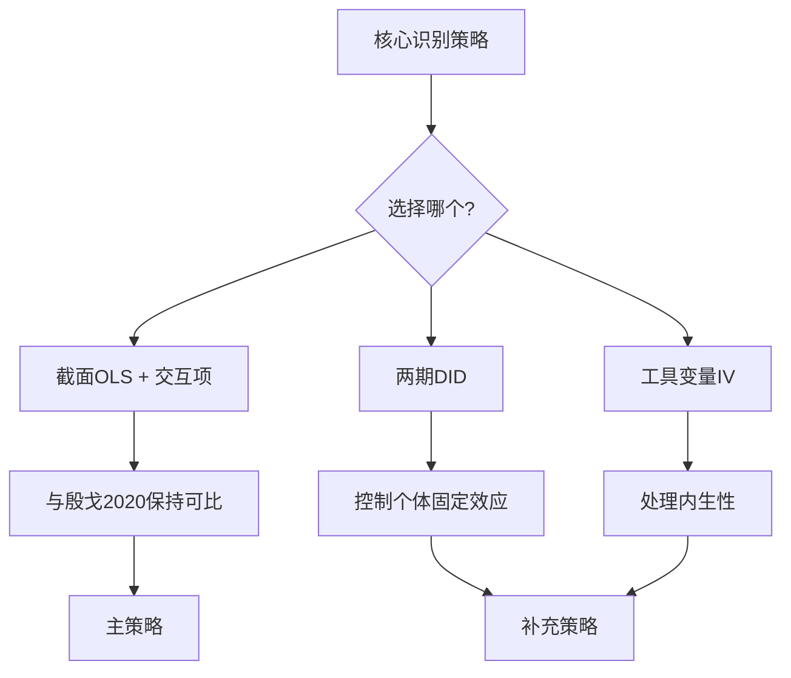

# 工作总清单：别人家的父母，别人的阴影

> 班级同学父母教育水平对青少年心理健康的非对称溢出效应 — 基于CEPS的因果识别
> 更新日期：2026-08-12
> 数据：CEPS 2013-2014（基线）+ 2014-2015（追踪）

---

## 总览

```
阶段一：数据准备与变量构造   →   阶段二：实证分析   →   阶段三：机制检验   →   阶段四：论文写作与交付
  (当前阶段)                         (四步递进)            (稳健性+中介)          (Supervisor-Skills)
```

---

## 阶段一：数据准备与变量构造（⭐ 当前阶段）

### 1.1 数据基础设施

| # | 任务 | 状态 | 依赖 | 说明 |
|---|---|---|---|---|
| 1.1.1 | 确认CEPS完整版原始数据路径 | ✅ 完成 | - | `CEPS/2013-2014/` 和 `CEPS/2014-2015/` 已确认 |
| 1.1.2 | 确认已有清洗数据可用性 | ✅ 完成 | - | `final_ceps_all1123.dta`（30708×240）可用 |
| 1.1.3 | 读取已有dofile理解变量构造逻辑 | ✅ 完成 | - | `data_merge.do`→`var_clean.do`→`regression.do` |
| 1.1.4 | 核查变量与实际需要的匹配度 | ✅ 完成 | - | 见下方"复用/修改清单" |

### 1.2 变量构造（核心任务）

| # | 任务 | 状态 | 预期输出 | 代码文件 |
|---|---|---|---|---|
| 1.2.1 | 构造心理健康因变量（基线a18→5题抑郁量表） | ⏳ 待做 | `mental_health_w1` 标准化得分 | `01_construct_mental_health.py` |
| 1.2.2 | 构造心理健康因变量（追踪w2c25→9题情绪量表） | ⏳ 待做 | `mental_health_w2` 标准化得分 | `01_construct_mental_health.py` |
| 1.2.3 | 两期心理健康对接（跨期可比性处理） | ⏳ 待做 | 两期共有5题或变化量 | `01_construct_mental_health.py` |
| 1.2.4 | 构造班级同学父母教育水平（核心自变量，leave-one-out） | ✅ 复用 | `cls_mean_max_education` 已存在 | 老师dofile已构造 |
| 1.2.5 | 构造家庭SES综合指数 | ⏳ 待做 | `ses_index` 或分类变量 | `02_construct_ses.py` |
| 1.2.6 | 构造学业压力中介变量（b32/w2a29） | ⏳ 待做 | `academic_pressure` | `03_construct_mediators.py` |
| 1.2.7 | 构造教养方式中介变量（b22-b24/w2a18-a21） | ⏳ 待做 | `parenting_style` 分类 | `03_construct_mediators.py` |
| 1.2.8 | 补充控制变量（已有可直接复用） | ✅ 复用 | 性别/民族/户口/独生等 | 老师dofile已有 |
| 1.2.9 | 构造班级层面心理健康不平等指标 | ⏳ 待做 | `cls_gini_mental` 等 | `04_class_inequality.py` |

### 1.3 数据合并

| # | 任务 | 状态 | 说明 |
|---|---|---|---|
| 1.3.1 | 将情绪题合并到清洗后数据 | ⏳ 待做 | 按 `ids + 期次` 匹配，注意两期堆叠 |
| 1.3.2 | 确认合并后无数据泄漏 | ⏳ 待做 | 核对合并前后样本量匹配 |
| 1.3.3 | 构造最终分析数据集 | ⏳ 待做 | 导出为 `analysis_data.dta` 或 `.csv` |

---

## 阶段二：实证分析（四步递进）

### 2.1 描述性统计

| # | 任务 | 状态 | 预期输出 |
|---|---|---|---|
| 2.1.1 | 核心变量描述性统计表 | ⏳ 待做 | Table 1：均值/标准差/分位数/样本量 |
| 2.1.2 | 心理健康分布可视化 | ⏳ 待做 | 直方图/密度图，按SES分组 |
| 2.1.3 | 核心变量相关性矩阵 | ⏳ 待做 | 热力图或相关性表 |

### 2.2 基准回归（截面OLS）

| # | 任务 | 状态 | 分析方法 |
|---|---|---|---|
| 2.2.1 | 全样本OLS：同学父母教育→心理健康 | ⏳ 待做 | 学校层面聚类标准误 |
| 2.2.2 | 低SES子样本回归 | ⏳ 待做 | 同上 |
| 2.2.3 | 高SES子样本回归 | ⏳ 待做 | 同上 |
| 2.2.4 | Wald检验：两组β₁是否显著不同 | ⏳ 待做 | 组间系数差异检验 |

### 2.3 非对称效应检验

| # | 任务 | 状态 | 分析方法 |
|---|---|---|---|
| 2.3.1 | 交互项模型：PeerEdu×SES | ⏳ 待做 | OLS + 交互项 |
| 2.3.2 | 边际效应图（不同SES水平） | ⏳ 待做 | 可视化边际效应及置信区间 |
| 2.3.3 | 三分组检验（高/中/低SES） | ⏳ 待做 | 分组回归+趋势检验 |

### 2.4 双重差分（DID）

| # | 任务 | 状态 | 分析方法 |
|---|---|---|---|
| 2.4.1 | 两期面板数据预处理 | ⏳ 待做 | 宽表/长表转换 |
| 2.4.2 | DID基准回归 | ⏳ 待做 | 个体固定效应+聚类标准误 |
| 2.4.3 | 平行趋势检验（简化版） | ⏳ 待做 | 基期趋势检验 |
| 2.4.4 | 安慰剂检验（伪处理时间） | ⏳ 待做 | 随机分配处理组 |

### 2.5 工具变量（IV）

| # | 任务 | 状态 | 分析方法 |
|---|---|---|---|
| 2.5.1 | 构造IV：同校其他年级同学父母教育水平 | ⏳ 待做 | leave-one-out班级层面 |
| 2.5.2 | 第一阶段回归+F统计量 | ⏳ 待做 | 检查弱工具变量 |
| 2.5.3 | 第二阶段IV回归 | ⏳ 待做 | IV-2SLS |
| 2.5.4 | 过度识别检验（如有多个IV） | ⏳ 待做 | Hansen J统计量 |

---

## 阶段三：机制检验与稳健性

### 3.1 机制检验

| # | 任务 | 状态 | 方法 |
|---|---|---|---|
| 3.1.1 | 学业压力中介效应检验（Sobel/Bootstrap） | ⏳ 待做 | 逐步法 + Bootstrap |
| 3.1.2 | 教养方式中介效应检验 | ⏳ 待做 | 同上 |
| 3.1.3 | 多重中介模型（学业压力+教养方式同时） | ⏳ 待做 | 结构方程或联合检验 |
| 3.1.4 | 师生关系"暗面"检验 | ⏳ 待做 | 交互项: 师生关系×SES |

### 3.2 稳健性检验

| # | 任务 | 状态 | 方法 |
|---|---|---|---|
| 3.2.1 | 替换因变量定义（不同量表构造方式） | ⏳ 待做 | 因子分析 vs 加总 vs 单题 |
| 3.2.2 | 替换核心自变量（大学比例 vs 均值） | ⏳ 待做 | `college_yn` 比例 |
| 3.2.3 | 排除极端值/异常学校 | ⏳ 待做 | 去除前/后1%或特定学校 |
| 3.2.4 | 随机分班学校子样本 | ⏳ 待做 | 按殷戈2020标准筛选 |
| 3.2.5 | 加入学校特定趋势 | ⏳ 待做 | 控制×时间趋势 |
| 3.2.6 | 多层级模型（HLM） | ⏳ 待做 | 学生-班级-学校三层 |

### 3.3 异质性分析

| # | 任务 | 状态 | 分组维度 |
|---|---|---|---|
| 3.3.1 | 按性别分组 | ⏳ 待做 | 男/女 |
| 3.3.2 | 按户口类型分组 | ⏳ 待做 | 城镇/农村 |
| 3.3.3 | 按年级分组 | ⏳ 待做 | 七年级/九年级 |
| 3.3.4 | 按地区（东/中/西）分组 | ⏳ 待做 | 区域差异 |

---

## 阶段四：论文写作与交付

### 4.1 写作流程（使用Supervisor-Skills）

| # | 任务 | 使用的Skill | 说明 |
|---|---|---|---|
| 4.1.1 | 系统文献调研 | `deep-research` | 综述级文献调研，产出survey报告 |
| 4.1.2 | 引言写作 | `intro-drafter` | 六段式Introduction，引用经核验 |
| 4.1.3 | 理论框架构建 | 手动 + `idea-evaluator` | 5维框架评估，确认故事方向 |
| 4.1.4 | 实证结果正文 | `paper-writer` | 证据门控，每个事实性声明可溯源 |
| 4.1.5 | 文献综述章节 | `deep-research` → `paper-writer` | 先调研后写作 |
| 4.1.6 | 图表设计 | `figure-designer` | 动机图/总览图/实验图 |
| 4.1.7 | 论文润色 | `paper-polish` | 改语法、去AI腔、中文→英文 |
| 4.1.8 | 投稿前审查 | `pre-submission-reviewer` | 审稿人视角全面审查 |

### 4.2 代码工程

| # | 任务 | 状态 | 说明 |
|---|---|---|---|
| 4.2.1 | 初始化Git仓库 | ✅ 完成 | 根目录，公开可访问 |
| 4.2.2 | 编写Python分析脚本 | ⏳ 待做 | 每个阶段独立脚本，可复现 |
| 4.2.3 | 代码注释（中英文） | ⏳ 待做 | 关键逻辑添加注释 |
| 4.2.4 | 编写README.md | ⏳ 待做 | 项目说明+复现指南 |
| 4.2.5 | 上传至GitHub公开仓库 | ⏳ 待做 | 供审稿人核查 |

---

## 现有数据复用/修改清单

### ✅ 可直接复用（来自老师dofile）
| 变量 | 说明 | 原始变量名 |
|---|---|---|
| 班级父母教育水平均值 | `cls_mean_max_education` | 已构造 |
| 班级父母教育水平标准差 | `cls_sd_max_education` | 已构造 |
| 学生层面控制变量 | 性别/民族/户口/独生等 | 各种 |
| 学校层面控制变量 | 公办/民办/地区/区域 | 各种 |
| 班级/学校ID | `clsids` / `schids` | 关键连接键 |
| 学生ID | `ids` | 关键连接键 |
| 成绩变量 | `tscore` / `tr_chn` / `tr_mat` / `tr_eng` | 控制变量/异质性 |

### ⚠️ 需要修改/补充
| 变量 | 问题 | 解决方案 |
|---|---|---|
| 心理健康（a18/w2c25） | 不在清洗后数据中 | 从完整版CEPS合并 |
| 学业压力（b32/w2a29） | 需要确认题号和构造 | 从完整版提取 |
| 教养方式（b22-b24/w2a18-a21） | 需要自行构造分类 | 从完整版提取+构造 |
| 两期对接 | 题项不同需处理可比性 | 用共有5题或因子分析 |

### ❌ 不适用（与本项目无关）
| 老师项目内容 | 原因 |
|---|---|
| "在校时长"相关变量 | 本项目核心自变量不同 |
| "教育减负"政策分析 | 本项目关注心理健康溢出 |
| 课外辅导时长/费用相关回归 | 本项目不关注投入替代效应 |

---

## 关键技术决策



**决策**：以截面OLS+交互项作为主策略（与殷戈2020保持完全可比），DID和IV作为补充识别策略。

---

## 参考文献

### 核心对话文献
1. 殷戈, 黄海, 黄炜 (2020). 人力资本代际外溢性——来自"别人家的父母"的证据. *经济学（季刊）*
2. Kim, J. (2020). Relative Deprivation within Schools and Adolescent Depression. *Society and Mental Health*
3. Merton, R. K. (1957). *Social Theory and Social Structure*
4. Runciman, W. G. (1966). *Relative Deprivation and Social Justice*
5. Doepke & Zilibotti (2019). Love, Money, and Parenting. *Journal of Political Economy*

### 方法论文献
6. Angrist & Pischke (2009). *Mostly Harmless Econometrics*
7. 陈强 (2014). *高级计量经济学及Stata应用*

---

## 附录：可用工具清单

### Supervisor-Skills（12个技能）
| 技能 | 用途 | 在本项目中的使用阶段 |
|---|---|---|
| `idea-evaluator` | 研究想法评估 | 阶段二前 |
| `deep-research` | 文献深度调研 | 阶段四 |
| `intro-drafter` | 引言写作 | 阶段四 |
| `paper-writer` | 证据门控正文写作 | 阶段四 |
| `paper-polish` | 语言润色 | 阶段四 |
| `pre-submission-reviewer` | 投稿前审查 | 阶段四 |
| `figure-designer` | 科研作图建议 | 阶段四 |
| `drawio-reconstruction` | 参考图→drawio | 阶段四 |
| `tech-paper-template` | 论文逻辑链梳理 | 阶段四 |
| `benchmark-paper-template` | Benchmark类论文模板 | 不适用 |
| `vibe-research-workflow` | AI辅助科研全流程 | 全阶段 |
| `idea-evaluator` | 5维框架评估 | 阶段二前 |

### 其他可用工具
| 工具 | 用途 |
|---|---|
| `empiricalwiki-main` | 实证研究方法论wiki |
| `pAI-Econ-claude-main` | 经济学理论模型构建 |
| `statistical-analysis` | 统计分析 |
| `literature-review` | 文献综述 |
| `peer-review` | 同行评审模拟 |