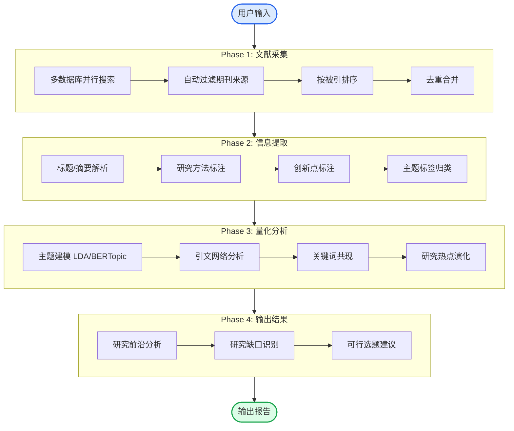

# Skill: research-topic-miner

# 研究选题方向挖掘

## Overview

本技能用于自动挖掘研究前沿、识别研究缺口、生成可行选题建议。通过多数据库文献采集与量化分析，帮助研究者快速把握领域动态并找到具有创新性的研究切入点。

## 适用场景

- 课题申报前的选题论证
- 学位论文开题方向探索
- 学术前沿动态监测
- 研究空白识别

## 触发关键词

研究选题、方向挖掘、前沿分析、研究缺口、选题建议、文献综述、研究空白、选题论证、开题报告

## 输入格式

```
用户输入: [关键词/研究主题] + [可选参数]
```

### 示例输入

- "数字经济 区域创新 研究选题"
- "西部陆海新通道 新质生产力 研究前沿"
- "人工智能 伦理治理 选题建议"

### 可选参数

- 时间范围: 近1年/近3年/近5年 (默认近3年)
- 学科偏好: 经济学/管理学/社会学等
- 方法偏好: 实证/理论

### 用户自有文献输入

用户可同时提供自有文献以指导分析:

- DOI列表: 10.1234/abc
- BibTeX文件: .bib
- CSV格式: 标题,作者,年份,期刊

## 工作流程



## 数据库配置

### 自动采集数据库

| 数据库 | 检索方式 | 期刊覆盖 |
|--------|----------|----------|
| **OpenAlex** | API | 跨学科全局覆盖 |
| **Elsevier ScienceDirect** | API | 商学/经管期刊全文 |
| **Web of Science** | API | UTD24/FT50/核心期刊 |
| **arXiv** | API | q-fin/cs/stat社会科学预印本 |
| **Google Scholar** | 有限API | 高被引补充 |
| **CNKI** | 知网API | CSSCI、北大核心 |

### 期刊过滤规则

```yaml
journal_filters:
  utd24: true    # UTD24商学期刊
  ft50: true     # FT50金融期刊
  cssci: true     # CSSCI来源期刊
  beida核心: true # 北大核心
```

### 用户自有文献

用户可通过以下方式提供自有文献:

- DOI列表 (自动获取元数据)
- BibTeX文件
- CSV文件 (标题,作者,年份,期刊)
- 手动输入

## 量化分析模块

### 主题建模

- 使用LDA或BERTopic进行主题聚类
- 自动生成主题标签和关键词
- 识别研究热点演化趋势

### 引文网络分析

- 构建文献引用网络
- 计算中介中心性、PageRank
- 识别高影响力枢纽文献

### 知识图谱

- 关键词共现分析
- 研究主题演化路径
- 理论框架可视化

## 输出报告结构

### 1. 研究前沿分析

- 当前研究热点主题及演变
- 高影响力文献特征
- 方法论发展趋势

### 2. 研究缺口识别

| 缺口类型 | 描述 |
|----------|------|
| 理论缺口 | 现有理论无法解释的现象 |
| 方法缺口 | 缺乏有效研究方法 |
| 实证缺口 | 某领域缺乏实证证据 |
| 区域缺口 | 特定区域/群体未覆盖 |

### 3. 可行选题建议

```yaml
选题编号: T-001
研究问题: xxx
理论视角: xxx
数据建议: xxx
方法建议: xxx
创新点: xxx
```

## 依赖技能集成

| 技能 | 用途 |
|------|------|
| **bgpt-paper-search** | 获取结构化论文数据 |
| **citation-management** | 引用验证与BibTeX生成 |
| **literature-review** | 综述模板参考 |
| **markdown-mermaid-writing** | 输出Mermaid知识图谱 |

## 注意事项

1. 文献采集优先选择高被引、高影响力文献
2. 主题建模结果需人工审核调整
3. 选题建议需结合研究者实际能力
4. 定期更新期刊白名单以保持时效性

## 文件结构

```
research-topic-miner/
├── SKILL.md                    # 本技能说明
├── config.yaml                 # 数据库配置、期刊白名单
├── scripts/
│   ├── collect_papers.py       # 文献采集脚本
│   ├── extract_info.py         # 信息提取脚本
│   ├── topic_modeling.py       # 主题建模脚本
│   ├── citation_network.py     # 引文网络分析脚本
│   └── generate_report.py      # 报告生成脚本
├── templates/
│   ├── topic_analysis.md       # 前沿分析输出模板
│   └── proposal_template.md    # 选题建议输出模板
└── data/
    ├── utd24_list.csv          # UTD24期刊列表
    ├── ft50_list.csv           # FT50期刊列表
    └── cssci_keywords.txt      # CSSCI期刊关键词
```

## 使用示例

### 基础使用

```
用户: 我想研究"数字经济与区域创新"，请帮我挖掘研究选题
→ 调用research-topic-miner技能
→ 返回前沿分析 + 研究缺口 + 选题建议
```

### 高级使用

```
用户: 帮我分析"人工智能伦理治理"研究前沿，我有10篇核心文献(DOI列表)
→ 调用research-topic-miner技能(包含用户文献)
→ 合并分析后返回更精准的选题建议
```

## 更新日志

- 2026-04-10: 初始版本
  - 支持6数据库并行采集
  - 支持用户自有文献输入
  - 支持期刊来源过滤(UTD24/FT50/CSSCI/北大核心)