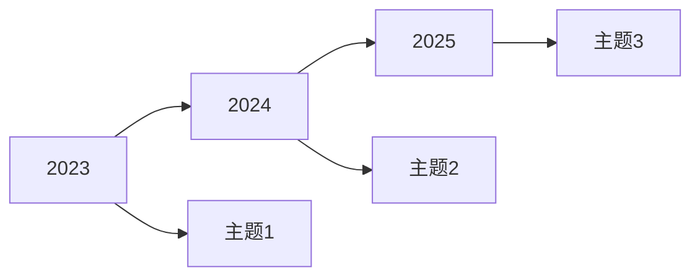

# 研究前沿分析报告模板

## 研究主题
[研究主题名称]

## 分析时间
[YYYY-MM-DD]

---

## 1. 文献概况

| 指标 | 数值 |
|------|------|
| 采集文献总数 | N |
| 核心期刊文献 | N |
| 高被引文献 | N |
| 识别主题数 | N |

---

## 2. 热点主题

### 2.1 主题聚类结果

| 主题编号 | 主题名称 | 核心关键词 | 论文数量 |
|----------|----------|------------|----------|
| T1 | 主题1 | 关键词1, 关键词2, 关键词3 | N |
| T2 | 主题2 | 关键词1, 关键词2, 关键词3 | N |
| T3 | 主题3 | 关键词1, 关键词2, 关键词3 | N |

### 2.2 高影响力文献

| 排名 | 论文标题 | 作者 | 年份 | 期刊 | 被引 |
|------|----------|------|------|------|------|
| 1 | xxx | xxx | 2024 | xxx | N |
| 2 | xxx | xxx | 2023 | xxx | N |

---

## 3. 研究方法分布

| 方法类型 | 文献数量 | 占比 |
|----------|----------|------|
| 实证研究 | N | N% |
| 计量分析 | N | N% |
| 案例研究 | N | N% |
| 理论研究 | N | N% |

---

## 4. 研究前沿趋势

### 4.1 主题演化

### 4.2 方法论趋势

- 传统计量方法为主
- 机器学习方法逐渐兴起
- 跨学科融合趋势明显

---

## 5. 核心结论

1. 当前研究热点集中于[主题1]、[主题2]领域
2. 高影响力研究主要采用[方法1]方法
3. 研究前沿正从[旧方向]向[新方向]演进

---

## 附录: 关键词列表

- 关键词1
- 关键词2
- 关键词3